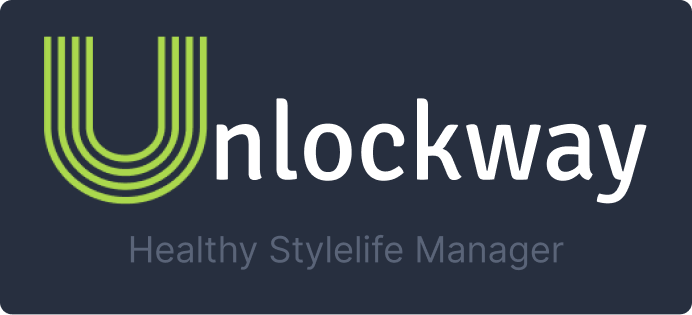
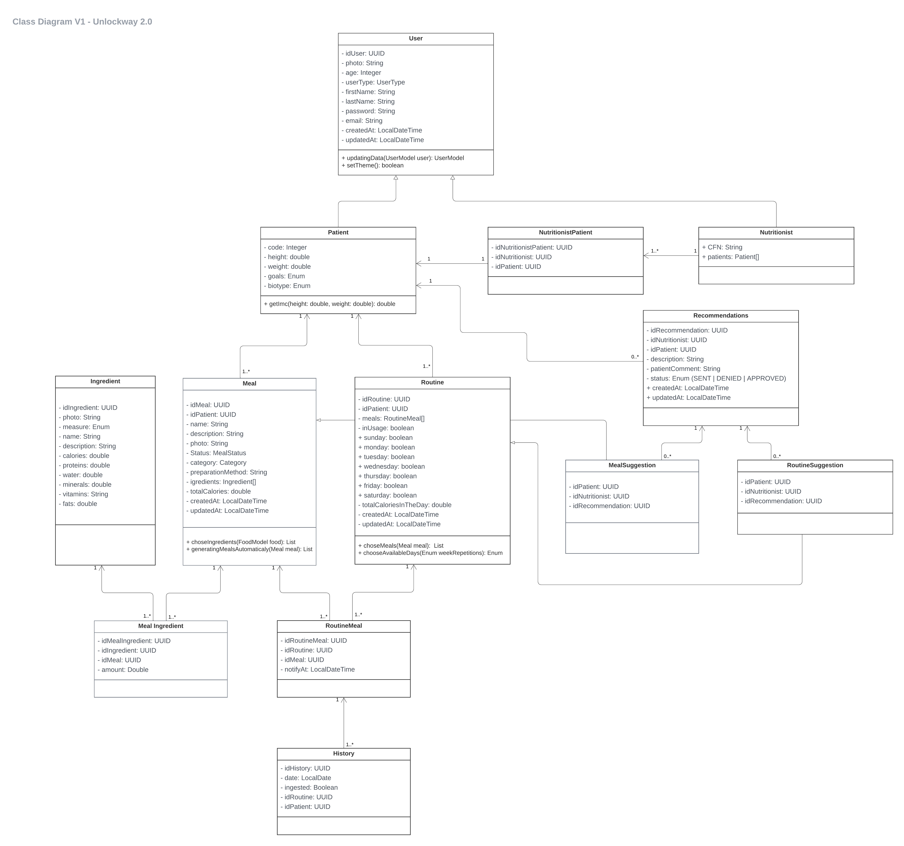
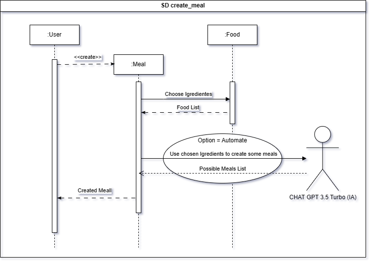
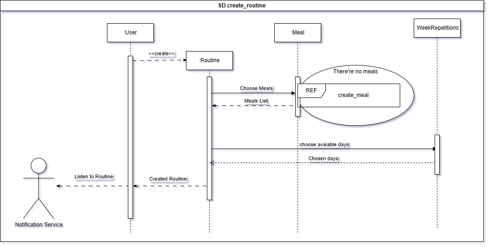
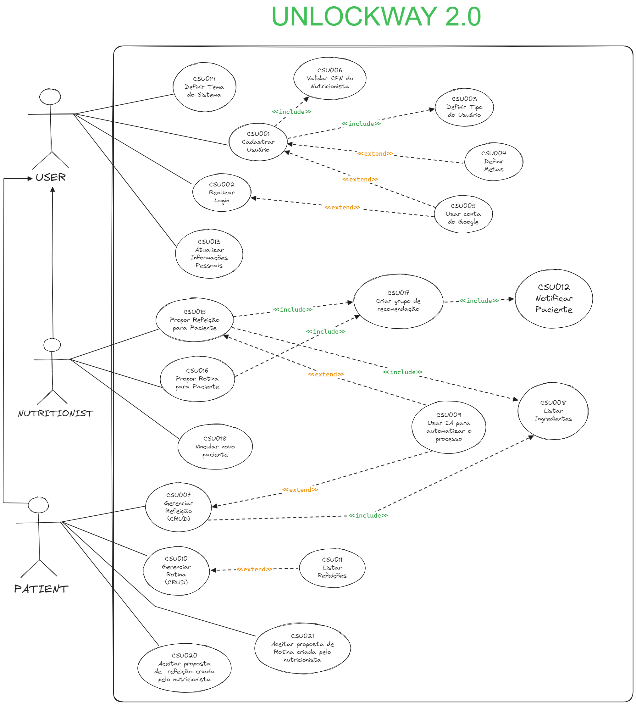
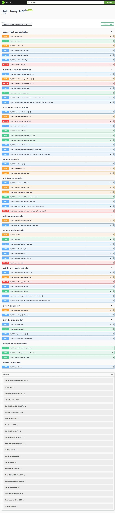

# 🥘 Healthy Meal Manager API (TCC Project)



       

> Acess the [PT-BR](./README-PTBR.md) Version

This project was built in college as part of an integration project between various subjects (TCC). The Healthy Meal Manager API is a robust and scalable API designed to manage healthy meal routines and notifications for users. Built using Spring Boot with Maven, it follows the MVC and Hexagon Architecture principles. The API leverages Hibernate JPA for database interactions with a PostgreSQL database, running locally via Docker and Docker Compose. For production, the API is deployed using Azure App Services, and images are stored using Azure Blob Storage. Authentication is handled using JWT tokens, which expire in one hour. The API endpoints are documented with Swagger. The API is used for a mobile Flutter application. You can find the mobile app repository [here](https://github.com/unlockway/unlockwayui).

> Access the Layout prototype built on Figma clicking [here](https://www.figma.com/design/eVCIm7PVUYjDSV6PrifbAG/Fatec---Projeto-Integrador%3A-Unlockway?node-id=0-1&t=JH2hcRXH9DhEu4BF-1)

## Class Diagram



## Sequence Diagrams

- Create a Meal



- Create a Routine



## Use Cases



## Preview



## Technologies

- **Java 17**
- **Spring Boot**
- **Maven**
- **Hibernate JPA**
- **PostgreSQL**
- **Docker & Docker Compose**
- **Azure App Services**
- **Azure Blob Storage**
- **JWT Authentication**
- **Swagger**
- **Flutter (Mobile Application)**

## How to set up your machine

1. **Clone the repository:**

   ```sh
   git clone https://github.com/unlockway/unlockway_api_v2.git
   cd ./unlockway_api_v2
   ```

2. **Install Docker and Docker Compose:**

   - [Docker Installation Guide](https://docs.docker.com/get-docker/)
   - [Docker Compose Installation Guide](https://docs.docker.com/compose/install/)

3. **Set up PostgreSQL database:**

   ```sh
   docker-compose up --build -d # or `docker compose up --build -d (whitout the -)`
   ```

4. **Configure application properties:**
   - Update `application.properties` with your local setup.

## How to execute

1. **Build the project:**

   ```sh
   mvn clean install
   ```

2. **Run the application:**

   ```sh
   mvn spring-boot:run
   ```

3. **Access Swagger documentation:**
   - Navigate to `http://localhost:8080/swagger-ui/index.html` to view and test the API endpoints.

You can use an IDE to execute the code as well. Here are some popular options:

- [Visual Studio Code](https://code.visualstudio.com/)
- [IntelliJ IDEA](https://www.jetbrains.com/idea/)

## How to Contribute

1. **Fork the repository**

2. **Create a new branch:**

   ```sh
   git checkout -b feature/your-feature-name
   ```

3. **Make your changes and commit them:**

   ```sh
   git commit -m "Add your message here"
   ```

4. **Push to the branch:**

   ```sh
   git push origin feature/your-feature-name
   ```

5. **Create a Pull Request**

### Contributors

|  |  |  |  |  |
| :-------------------------------------------------: | :----------------------------------------------------: | :-------------------------------------------------------: | :-------------------------------------------------: | :---------------------------------------------: |
|   [Victor H. Silva](https://github.com/vickttor)    |   [Bruno Pequeno](https://github.com/bruno-pequenor)   |   [Daniel Vieira](https://github.com/DanielVieira2828)    |   [Felipe Thaylan](https://github.com/ThaylanFe)    |   [João Zavisas](https://github.com/Zavisas)    |
